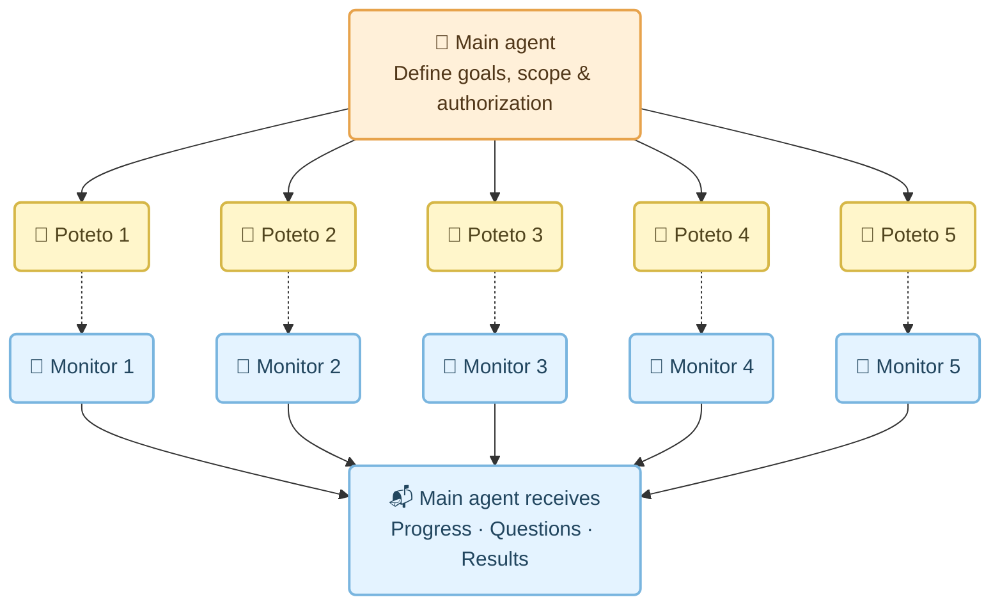
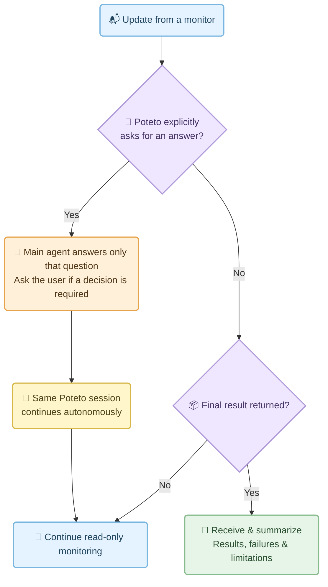

# Orca Task Coordinator

An English agent skill for delegating independent tasks to autonomous Poteto sessions in ordinary Orca worktrees.

Before launch, the coordinator establishes goals, scope, authorization, dependencies, and resource ownership. After startup, Poteto owns execution. One read-only monitoring subagent observes each independent task. The coordinator answers only explicit questions from the executor and summarizes returned results without adding another review or acceptance loop.

Existing project rules, user stop/change instructions, permissions, CI requirements, and release protections still apply. A returned report is not independent verification.

## Install

Copy `skills/orca-task-coordinator` into your Codex skills directory (usually `~/.codex/skills/`). Keep the runtime scripts together. Start a new session and invoke `$orca-task-coordinator`.

The skill requires a working Orca installation, a registered Git repository, an installed executor, Python 3.9+, and a separately installed `pstack:poteto-mode`. This repository does not bundle Poteto or Orca. Use the target project's own rules and installed tool documentation.

## Workflow

### Five tasks, five read-only monitors

Each Poteto session owns one independent task in its own worktree. Each monitor is a separate subagent; dotted arrows represent read-only observation.



### The feedback loop

Only an explicit question from Poteto triggers a reply. The answer goes back to the same session; execution remains autonomous.



**Slow progress, silence, red CI, and missing steps are reported, not used to steer execution.** No nudging, extra acceptance loop, or automatic rework.

When monitor capacity is limited, queue monitors or let the main agent temporarily observe read-only. Execution sessions can still run independently. Existing authorization, project rules, and release protections remain in force.

## Launcher and validation

See [the launcher contract](skills/orca-task-coordinator/references/launcher-contract.md) for arguments, model selection, baseline branches, logs, and observation semantics. The launcher's historical Claude default is not a recommendation; explicitly pass the user's configured model label. Non-main repositories can select `--base-branch`.

```sh
python3 -B -m unittest discover -s skills/orca-task-coordinator/scripts -p 'test_*.py'
```

Tests use temporary directories and mocked subprocesses. They do not start Orca sessions or prove live end-to-end behavior.
