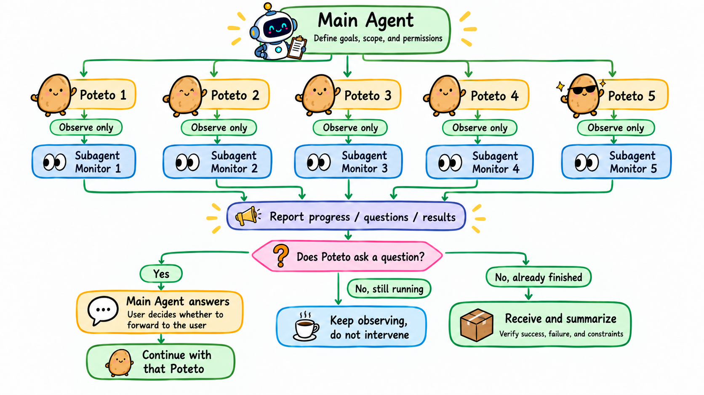

# Orca Task Coordinator

[English](README.md) | [简体中文](README.zh-CN.md)

把独立任务交给 Poteto，在各自的 Orca worktree 和会话中自主执行。支持 Codex 和 Claude Code。

启动前，主 agent 明确目标、范围、授权、依赖和资源归属。启动后，每个任务由 Poteto 自主执行，另配一个只读监控 subagent。主 agent 只回答执行者明确提出的问题，并汇总返回结果，不额外组织审查或验收。

项目规则、用户的停止或修改指令、权限、必需 CI 和发布保护仍然适用。执行者的报告不等于外层独立验证。

## 安装

使用 [skills CLI](https://skills.sh/docs)：

```sh
npx skills add andy00614/orca-task-coordinator --skill orca-task-coordinator
```

按提示选择 Codex 或 Claude Code，以及项目或全局安装范围。

为 Codex 全局安装：

```sh
npx skills add andy00614/orca-task-coordinator --skill orca-task-coordinator --agent codex --global
```

为 Claude Code 全局安装：

```sh
npx skills add andy00614/orca-task-coordinator --skill orca-task-coordinator --agent claude-code --global
```

也可以把 `skills/orca-task-coordinator` 复制到对应的 skills 目录：Codex 通常是 `~/.codex/skills/`，Claude Code 是 `~/.claude/skills/`。保持运行脚本在同一目录。新开会话后，Codex 使用 `$orca-task-coordinator`，Claude Code 使用 `/orca-task-coordinator`。

需要已安装并可用的 Orca、已注册的 Git 仓库、Codex 或 Claude Code 执行 agent、Python 3.9+，以及单独安装的 [`pstack:poteto-mode`](https://github.com/michael-denyer/pstack-claude#install)。本仓库不包含 Poteto 或 Orca。依赖缺失时，agent 会说明缺什么并提供安装指引，不自动安装。执行时遵循目标项目的实际规则和已安装工具的文档。

pstack 同时支持 Codex 和 Claude Code；请按[上游安装说明](https://github.com/michael-denyer/pstack-claude#install)选择对应的安装方式。Orca 启动器的参数是 `--agent codex` 或 `--agent claude`；skills CLI 安装时 Claude Code 的标识是 `claude-code`。

## 工作流程



每个 Poteto 会话在自己的 worktree 中负责一个独立任务，每个监控都是独立的只读 subagent。主 agent 只回答明确提问，需要用户决定时才转问用户；收到结果后如实汇总，不增加一轮验收。

**进度慢、日志沉默、CI 失败和步骤缺失只作为事实汇报，不触发外层干预。** 不催促，不额外验收，不自动要求返工。

监控并发名额不足时，监控可以排队，或由主 agent 临时只读观察。执行会话仍可独立运行。已有授权、项目规则和发布保护继续有效。

## 启动器与验证

参数、模型选择、基线分支、日志和状态含义见[启动器说明](skills/orca-task-coordinator/references/launcher-contract.md)。脚本保留的 Claude 历史默认值不是模型推荐；调用时应明确传入用户已配置的模型显示名。基线不是 `main` 的仓库可使用 `--base-branch`。

```sh
python3 -B -m unittest discover -s skills/orca-task-coordinator/scripts -p 'test_*.py'
```

测试使用临时目录和模拟的进程调用，不启动 Orca 会话，也不证明真实端到端执行已经验证。
